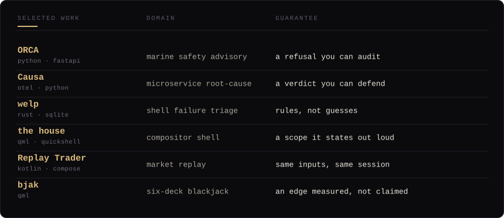

 

<i>welp, doing the thing it exists to do</i>

  

**ORCA** fuses ISRO, INCOIS, DGLL and NOAA feeds into go/no-go guidance for Indian fishermen.
The reasoning layer can be probabilistic; the safety policy cannot — every hard constraint is
deterministic Python, so a refusal is reproducible and traceable to the data that caused it.

**Causa** answers the only hard question during an outage: which failure is the *cause* and
which are downstream victims. It reconstructs the incident as dependency graphs, ranks the
root-cause service with a confidence score and a plain-language why, then gates remediation
behind a human and a canary.

**welp** diagnoses your last failed command from context the shell already had — exit code,
toolchain state, config on disk. Rules, not guesses: no model call, no network, and small
enough that the hook never makes your prompt feel slow.

 

 

 

 

 

 

 

&nbsp;

&nbsp;

  

<i>the edge is measured, not claimed</i> &nbsp;♠

<!-- ──────────────────────────────────────────────────────────────────────────
     Repo pin cards — add a line per repo as it goes public, filling in the
     real owner/name. Nothing is linked until then, so no card can 404.

     GitHub analytics — held back until the real repos are public so the
     numbers match the work above.

&nbsp;

────────────────────────────────────────────────────────────────────────── -->
